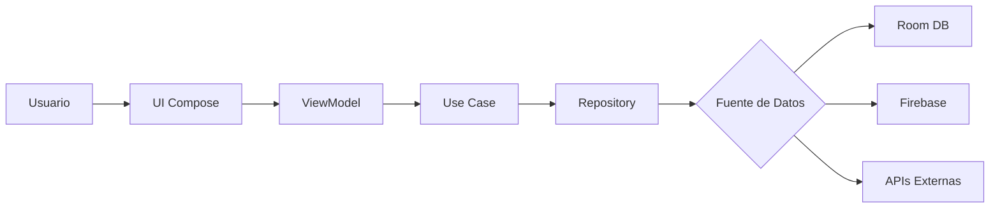

# 🍽️ MoodNutri

> **AI-Powered Recipe Recommendations Based on Your Mood & Ingredients**
>
> Integrantes: Lázaro Díaz y Luis Girón
> Link Firebase: https://appdistribution.firebase.dev/i/a555624bad25dbc3
> Link video: https://www.canva.com/design/DAG5TZvIgCU/K7ipDyGTsJ4lfPKFb70X5A/edit?utm_content=DAG5TZvIgCU&utm_campaign=designshare&utm_medium=link2&utm_source=sharebutton

[](https://kotlinlang.org)
[](https://developer.android.com/jetpack/compose)
[](https://firebase.google.com)
[]()

## 📱 Acerca del Proyecto

**MoodNutri** es una aplicación Android innovadora que combina inteligencia artificial con nutrición personalizada. Usando análisis de sentimientos y visión por computadora, la app sugiere recetas adaptadas a tu estado emocional, ingredientes disponibles y tiempo de cocina.

### ✨ Características Principales

- 🧠 **Recomendaciones Inteligentes por IA**: Integración con Gemini y OpenAI
- 📸 **Escaneo de Ingredientes**: Análisis visual con IA para detectar ingredientes
- 🍽️ **Análisis Nutricional**: Escanea tu comida preparada y obtén información nutricional
- 💚 **Sistema de Favoritos**: Guarda hasta 5 recetas offline con Room Database
- 🌍 **Multiidioma**: Soporte para Inglés, Español y Francés
- 🌓 **Modo Oscuro**: Temas claro, oscuro y automático
- 📊 **Seguimiento Nutricional**: Monitorea tus calorías, proteínas y carbohidratos diarios
- 🔐 **Autenticación Segura**: Firebase Authentication

---

## 🏗️ Arquitectura

### Patrón MVI (Model-View-Intent)

```
📦 com.example.moodnutri
┣ 📂 data
┃ ┣ 📂 local          # Room Database, DAOs
┃ ┣ 📂 remote         # Retrofit, API Services
┃ ┣ 📂 repository     # Repositorios de datos
┃ ┣ 📂 models         # Data classes
┃ ┗ 📂 preferences    # DataStore
┣ 📂 domain
┃ ┗ 📂 usecases       # Lógica de negocio
┣ 📂 presentation
┃ ┣ 📂 screens        # Pantallas con ViewModels
┃ ┣ 📂 components     # Componentes reutilizables
┃ ┗ 📂 navigation     # Navegación Compose
┣ 📂 ui
┃ ┗ 📂 theme          # Colores, tipografía, temas
┗ 📂 utils            # Helpers y utilidades
```

### Diagrama de Flujo



---

## 🚀 Tecnologías Utilizadas

### Core
- **Kotlin** 1.9.0
- **Jetpack Compose** - UI declarativa
- **Material3** - Design system
- **Coroutines** + **Flow** - Programación asíncrona

### Arquitectura
- **MVI Pattern** - Unidirectional data flow
- **ViewModel** - Gestión de estado
- **Navigation Compose** - Navegación entre pantallas
- **Use Cases** - Separación de lógica de negocio

### Almacenamiento
- **Room** - Base de datos local (favoritos offline)
- **DataStore** - Preferencias del usuario
- **Firebase Firestore** - Base de datos cloud
- **Firebase Auth** - Autenticación

### APIs y Servicios Externos
1. **Gemini AI** (`gemini-2.5-flash`) - Análisis de imágenes de ingredientes y comidas
2. **OpenAI API** (`gpt-4`, `gpt-3.5-turbo`) - Generación inteligente de recetas
3. **TheMealDB API** - Base de datos de recetas reales
4. **Firebase** - Autenticación y almacenamiento cloud

### Librerías Adicionales
- **Retrofit** + **Gson** - Networking
- **Coil** - Carga de imágenes
- **Material Icons Extended** - Iconografía

---

## 📋 Requisitos del Sistema

- **Android 12.0 (API 32)** o superior
- **Conexión a Internet** (para funcionalidades de IA)
- **Cámara** (opcional, para escaneo de ingredientes/comidas)

---

## 🔧 Configuración del Proyecto

### 1. Clonar el Repositorio

```bash
git clone https://github.com/tu-usuario/moodnutri.git
cd moodnutri
```

### 2. Configurar APIs

Crea un archivo `local.properties` en la raíz del proyecto:

```properties
# APIs de IA
GEMINI_API_KEY=tu_api_key_de_gemini
CHATGPT_API_KEY=tu_api_key_de_openai

# SDK
sdk.dir=/ruta/a/tu/Android/Sdk
```

### 3. Configurar Firebase

1. Crea un proyecto en [Firebase Console](https://console.firebase.google.com)
2. Agrega una app Android con el paquete `com.example.moodnutri`
3. Descarga `google-services.json` y colócalo en `app/`
4. Habilita **Authentication** (Email/Password) y **Firestore**

### 4. Estructura de Firestore

```
users/
  └─ {userId}/
      ├─ recipes/
      │   └─ {recipeId}/
      │       ├─ name: string
      │       ├─ ingredients: array
      │       ├─ steps: array
      │       ├─ isFavorite: boolean
      │       └─ timestamp: number
      └─ daily_nutrition/
          └─ {yyyy-MM-dd}/
              ├─ caloriesConsumed: number
              ├─ proteinConsumed: number
              └─ carbsConsumed: number
```

### 5. Compilar y Ejecutar

```bash
./gradlew build
./gradlew installDebug
```

O usa Android Studio:
- **File** → **Open** → Selecciona el proyecto
- **Run** → **Run 'app'**

---

## 📱 Funcionalidades Detalladas

### 🏠 Pantalla Principal (Home)
- Input de estado emocional del usuario
- Selección de tiempo disponible para cocinar
- Navegación rápida a escaneo de ingredientes

### 📸 Escaneo de Ingredientes
1. Toma una foto de tus ingredientes
2. La IA detecta y lista los ingredientes automáticamente
3. Edita manualmente la lista si es necesario
4. Genera una receta personalizada basada en:
   - Tus ingredientes disponibles
   - Tu estado de ánimo actual
   - Tiempo disponible para cocinar

### 🍳 Generación de Recetas
- Búsqueda en TheMealDB con ingredientes traducidos
- Generación con IA que combina:
  - Recetas reales de la base de datos
  - Adaptación al contexto del usuario (mood + tiempo)
  - Explicación de por qué la receta es adecuada
- Guarda hasta 10 recetas (no favoritas) en Firebase

### ⭐ Sistema de Favoritos
- **Local**: Hasta 5 recetas disponibles offline (Room)
- **Cloud**: Favoritos ilimitados en Firebase Firestore
- Toggle rápido de favoritos desde cualquier receta
- Vista dedicada con filtros Local/Cloud

### 🔍 Análisis Nutricional
1. Escanea tu comida preparada con la cámara
2. La IA identifica ingredientes y cantidades
3. Calcula automáticamente:
   - Calorías totales
   - Proteínas (g)
   - Carbohidratos (g)
4. Agrega la comida al seguimiento diario

### 👤 Perfil de Usuario
- Visualización de estado emocional actual
- Progreso nutricional diario con gráficos circulares
- Configuración de objetivos personalizados:
  - Meta de calorías diarias
  - Meta de proteínas diarias
  - Meta de carbohidratos diarios
- Cambio de idioma (EN/ES/FR)
- Cambio de tema (Claro/Oscuro/Sistema)
- Foto de perfil personalizable

---

## 🎨 UI/UX Highlights

### Material Design 3
- **Color Scheme Adaptativo**: Tema verde naturaleza
- **Modo Oscuro Completo**: Colores optimizados para OLED
- **Elevaciones y Sombras**: Jerarquía visual clara
- **Animaciones Fluidas**: Transiciones suaves entre estados

### Componentes Reutilizables
- `SharedTopAppBar` - Barra superior con logo
- `SharedBottomNavigationBar` - Navegación inferior consistente
- `ImageSelectionButton` - Botón de cámara reutilizable
- `NutritionCard` - Card para mostrar macros

### Responsive Design
- Layouts que se adaptan a diferentes tamaños de pantalla
- Scroll habilitado en pantallas con contenido extenso
- Feedback visual en todos los estados (loading, error, success)

---

## 🧪 Testing

### Tests Implementados
- ✅ `ExampleUnitTest` - Test de ejemplo
- ✅ `ExampleInstrumentedTest` - Test de instrumentación

### Cobertura Objetivo
- **Meta**: 10% de cobertura para puntos extra
- **Estado Actual**: Estructura básica implementada

### Ejecutar Tests
```bash
# Tests unitarios
./gradlew test

# Tests de instrumentación
./gradlew connectedAndroidTest
```

---

## 🌐 Internacionalización

### Idiomas Soportados
1. **Inglés** (EN) - Idioma por defecto
2. **Español** (ES) - `values-es/strings.xml`
3. **Francés** (FR) - `values-fr/strings.xml`

### Cambio de Idioma
El idioma se aplica inmediatamente en toda la app mediante:
- DataStore para persistencia
- `LocaleHelper` para cambio de configuración
- Recreación de Activity para aplicar cambios

---

## 🔐 Seguridad

### Manejo de API Keys
- Keys almacenadas en `local.properties` (no commiteadas)
- Acceso mediante `BuildConfig` en tiempo de compilación
- Archivo `.gitignore` configurado correctamente

### Firebase Security Rules (Recomendadas)

```javascript
rules_version = '2';
service cloud.firestore {
  match /databases/{database}/documents {
    match /users/{userId}/{document=**} {
      allow read, write: if request.auth != null && request.auth.uid == userId;
    }
  }
}
```

---

## 📊 Casos de Uso Principales

### 1. Búsqueda Inteligente de Recetas
**Actor**: Usuario autenticado  
**Flujo**:
1. Usuario ingresa su estado de ánimo y tiempo disponible
2. Usuario escanea o ingresa ingredientes manualmente
3. Sistema llama a `SearchRecipeUseCase`
4. Use case traduce ingredientes al inglés (OpenAI)
5. Busca recetas coincidentes en TheMealDB
6. Genera receta personalizada con OpenAI considerando el mood
7. Muestra receta con imagen, ingredientes, pasos y explicación

### 2. Análisis Nutricional de Comida
**Actor**: Usuario autenticado  
**Flujo**:
1. Usuario toma foto de su comida preparada
2. Sistema llama a `AnalyzeMealUseCase` con Gemini AI
3. IA detecta ingredientes y estima cantidades
4. Usuario revisa y edita la lista de ingredientes
5. Sistema llama a `CalculateNutritionUseCase`
6. Gemini calcula calorías, proteínas y carbohidratos
7. Usuario agrega la comida al seguimiento diario
8. Sistema actualiza progreso nutricional en `ProfileViewModel`

---

## 🐛 Problemas Conocidos y Soluciones

### Firebase Index Creation
**Problema**: Query requires index al buscar recetas guardadas  
**Solución**: Los índices se crean automáticamente en la primera query, o manualmente desde Firebase Console

### API Rate Limits
**Problema**: Límites de llamadas a APIs de IA  
**Solución**: Implementar caché local y debouncing en búsquedas

---

## 📈 Roadmap y Mejoras Futuras

### Corto Plazo
- [ ] Aumentar cobertura de tests a 10%+
- [ ] Implementar shimmer effects en loading states
- [ ] Agregar paginación en lista de recetas guardadas
- [ ] Modo offline completo con sincronización

### Mediano Plazo
- [ ] Integración con wearables (smartwatch)
- [ ] Compartir recetas via intents
- [ ] Notificaciones push para recordatorios de comida
- [ ] Widget de home screen con progreso nutricional

### Largo Plazo
- [ ] Soporte para tablets con layout adaptativo
- [ ] Integración con fitness trackers (Google Fit)
- [ ] Machine Learning on-device para predicciones offline
- [ ] Comunidad de usuarios y recetas compartidas

---

## 👥 Contribuciones

Este proyecto es parte de un curso académico. Para contribuir:

1. Fork el proyecto
2. Crea una rama feature (`git checkout -b feature/AmazingFeature`)
3. Commit tus cambios (`git commit -m 'Add some AmazingFeature'`)
4. Push a la rama (`git push origin feature/AmazingFeature`)
5. Abre un Pull Request

---

## 📄 Licencia

Este proyecto fue desarrollado con fines académicos para el curso de Laboratorio de Computación Móvil de la Universidad del Valle de Guatemala.

---

## 🙏 Agradecimientos

- **Universidad del Valle de Guatemala** - Campus Central
- **TheMealDB** - API de recetas gratuita
- **Google Gemini** - API de IA para análisis de imágenes
- **OpenAI** - API para generación de texto inteligente
- **Firebase** - Plataforma de backend

---


## 📸 Screenshots

### Home Screen


### Escaneo de Ingredientes


### Receta Generada


### Perfil con Tracking Nutricional


---

<div align="center">
  <p>Hecho con ❤️ y 🤖 IA</p>
  <p>MoodNutri © 2025</p>
</div>
